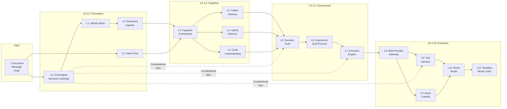

# AIUCE System 🏯

<!-- Badges -->
[](https://github.com/billgaohub/AIUCE/actions)
[](https://opensource.org/licenses/MIT)
[](https://www.python.org/downloads/)
[](#-tests)
[](#--11-layer-architecture)
[](https://github.com/billgaohub/AIUCE/commits/main)
[](https://github.com/billgaohub/AIUCE/stargazers)

> **AIUCE** = **A**I System + **U**niverse + **C**onstitution + **E**volution
>
> 🏯 Personal AI Infrastructure with 11-Layer Governance — Inspired by Ancient Chinese Wisdom
>
> *给AI装上"宪法"和"御史台" · Equipping AI with a Constitution and an Imperial Supervisor*

---

## 📋 Table of Contents

- [Why AIUCE?](#-why-aiuce)
- [11-Layer Architecture](#--11-layer-architecture)
- [Core Modules](#-core-modules)
- [Quick Start](#--quick-start)
- [Multi-Model Support](#--multi-model-support-l8)
- [Security Features](#--security-features)
- [Documentation](#--documentation)
- [Related Projects](#--related-projects)
- [Architecture Philosophy](#--architecture-philosophy)

---

## 🎯 Why AIUCE?

### The Problem with AI Today

| Problem | Impact |
|---------|--------|
| ❌ **Black Box** | You cannot understand why AI made a decision |
| ❌ **Unpredictable** | AI evolves in unexpected directions |
| ❌ **No Veto Power** | You cannot stop AI from doing harmful things |
| ❌ **No Memory** | AI forgets context across sessions |
| ❌ **No Accountability** | You cannot trace who made what decision |

### The AIUCE Solution

| Solution | Layer | Description |
|----------|-------|-------------|
| ✅ **Constitutional Veto** | L0 | Supreme Constitution with one-vote veto — no action without consent |
| ✅ **Controlled Evolution** | L7 | Conservative but continuous improvement — gradual kernel refactoring |
| ✅ **Full Audit Trail** | L5 | Every decision is logged with hash chain — immutable, traceable |
| ✅ **Semantic Memory** | L4 | Persistent knowledge across sessions — 96.6% retrieval rate |
| ✅ **11-Layer Governance** | L0–L10 | Checks and balances at every level — no layer dominates |

---

## 🏛️ 11-Layer Architecture

AIUCE implements a unique **11-layer governance structure** inspired by ancient Chinese bureaucratic wisdom. Each layer has a distinct minister, philosophy, and responsibility — forming a complete governance ecosystem from **Will** (L0) to **Sandbox** (L10).

### Architecture Overview (Mermaid)

```mermaid
flowchart TB
    subgraph L0["🏛️ L0 — WILL ( Sovereignty )"]
        L0A["Qin Shi Huang<br/>Sovereignty Gateway"]
        L0B["Wei Zheng<br/>Semantic Gateway"]
    end

    subgraph L1["📜 L1 — IDENTITY"]
        L1A["Zhuge Liang<br/>Identity Brain<br/><small>MECE Entity Registry</small>"]
    end

    subgraph L2["👁️ L2 — PERCEPTION"]
        L2A["Zhang Liang<br/>Document Ingestor<br/><small>Multi-format → Markdown</small>"]
        L2B["Intent Flow<br/><small>Streaming Latent Needs</small>"]
    end

    subgraph L3["🧠 L3 — REASONING"]
        L3A["Zhang Liang<br/>Cognitive Orchestrator<br/><small>3-Level Control + DAG Planning</small>"]
    end

    subgraph L4["💾 L4 — MEMORY"]
        L4A["Sima Qian<br/>Palace Memory<br/><small>96.6% Retrieval</small>"]
        L4B["Hybrid Memory<br/><small>Workspace/User/Global</small>"]
        L4C["Code Understanding<br/><small>AST + Leiden</small>"]
    end

    subgraph L5["⚖️ L5 — DECISION"]
        L5A["Bao Zheng<br/>Decision Audit<br/><small>3-Domain Scoring + Hash Chain</small>"]
    end

    subgraph L6["📊 L6 — EXPERIENCE"]
        L6A["Zeng Guofan<br/>Experience Layer<br/><small>Daily Review + Pattern</small>"]
        L6B["Dual Process<br/><small>System 1 (Fast) / System 2 (Slow)</small>"]
    end

    subgraph L7["🔧 L7 — EVOLUTION"]
        L7A["Shang Yang<br/>Evolution Engine<br/><small>GDPVal Benchmark + Self-Evolution</small>"]
    end

    subgraph L8["🌐 L8 — INTERFACE"]
        L8A["Zhang Qian<br/>Multi-Provider Gateway<br/><small>OpenAI · Claude · Qwen · DeepSeek</small>"]
    end

    subgraph L9["⚔️ L9 — AGENT"]
        L9A["Han Xin<br/>Tool Harness<br/><small>Constitutional Registry</small>"]
        L9B["Asset Custody<br/><small>Account Abstraction</small>"]
    end

    subgraph L10["🔮 L10 — SANDBOX"]
        L10A["Zhuangzi<br/>World Model<br/><small>T^ dynamics · R^ reward · G^ task</small>"]
        L10B["Monte Carlo<br/><small>Shadow Universe Simulation</small>"]
    end

    %% Data flow
    L0A --> L1A
    L0B --> L1A
    L1A --> L2A
    L1A --> L2B
    L2A --> L3A
    L2B --> L3A
    L3A --> L4A
    L3A --> L4B
    L3A --> L4C
    L4A --> L5A
    L4B --> L5A
    L4C --> L5A
    L5A --> L6A
    L5A --> L6B
    L6A --> L7A
    L6B --> L7A
    L7A --> L8A
    L8A --> L9A
    L8A --> L9B
    L9A --> L10A
    L9B --> L10A
    L10A --> L10B
    L10B -.->|Reflect| L0A

    %% Sovereignty Veto (L0)
    L5A -. "|veto| L0A"
    L7A -. "|veto| L0A"
    L9A -. "|veto| L0A"
```

> **L0 Veto**: The Sovereignty Gateway holds the Supreme Constitution veto — any L5/L7/L9 decision can be blocked at L0.

### Layer Detail

| Layer | Name | Minister | Core Module | Concept | Status |
|-------|------|---------|------------|---------|--------|
| **L0** | Will | Qin Shi Huang | `l0_sovereignty_gateway.py` | P1–P7 Constitution + Keyword Veto | ✅ |
| **L0** | Semantic | Wei Zheng | `l0_semantic_gateway.py` | Semantic confidence + Compliance | ✅ |
| **L0** | Sovereignty | — | `core/sovereignty.py` | Data localization + Privacy boundary | ✅ |
| **L1** | Identity | Zhuge Liang | `l1_identity_brain.py` | MECE entity directory | ✅ |
| **L2** | Perception | Zhang Liang | `l2_document_ingestor.py` | Universal Markdown conversion | ✅ |
| **L2** | IntentFlow | — | `core/intent_flow.py` | Streaming latent needs inference | ✅ |
| **L3** | Reasoning | Zhang Liang | `l3_cognitive_orchestrator.py` | 3-level cognitive + DAG planning | ✅ |
| **L4** | Memory | Sima Qian | `l4_palace_memory.py` | Memory Palace + 96.6% retrieval | ✅ |
| **L4** | HybridMemory | — | `core/hybrid_memory.py` | Workspace/User/Global three-tier | ✅ |
| **L4** | CodeUnderstanding | Sima Qian | `l4_code_understanding.py` | AST zero-LLM + Leiden community | ✅ |
| **L5** | Decision | Bao Zheng | `l5_audit.py` | 3-domain scoring + hash chain | ✅ |
| **L6** | Experience | Zeng Guofan | `l6_experience.py` | Daily review + Pattern recognition | ✅ |
| **L6** | DualProcess | — | `core/dual_process.py` | System 1 (Fast) + System 2 (Slow) | ✅ |
| **L7** | Evolution | Shang Yang | `l7_evolution_engine.py` | GDPVal benchmark + Skill evolution | ✅ |
| **L8** | Interface | Zhang Qian | `l8_interface.py` | Multi-provider API gateway | ✅ |
| **L9** | Agent | Han Xin | `l9_tool_harness.py` | Constitutional registry + routing | ✅ |
| **L9** | AssetCustody | — | `core/asset_custody.py` | Account/transaction abstraction | ✅ |
| **L10** | Sandbox | Zhuangzi | `l10_sandbox.py` | Monte Carlo / Shadow Universe | ✅ |
| **L10** | WorldModel | — | `core/world_model.py` | T^ dynamics · R^ reward · G^ task | ✅ |

> **Progress**: 11/11 core layer modules implemented + 6 PASK upgrade modules (2026)

---

## 📦 Core Modules

### Module Map



### Key Capabilities

| Capability | Layer | Description |
|-----------|-------|-------------|
| **Constitutional Veto** | L0 | Blocks actions violating core rules via keyword + semantic checks |
| **Intent Streaming** | L2 | Detects latent user needs from context in real-time |
| **Cognitive DAG Planning** | L3 | Breaks complex tasks into directed acyclic graph of sub-tasks |
| **Memory Palace** | L4 | Spatial memory system with 96.6% retrieval rate |
| **Hash Chain Audit** | L5 | Immutable decision log — tamper-evident via blockchain-like chaining |
| **Dual Process** | L6 | System 1 (fast intuitive) + System 2 (slow deliberate) reasoning |
| **GDPVal Benchmark** | L7 | Evaluates skill performance via ground-truth benchmarks |
| **Multi-Provider Gateway** | L8 | Unified API for OpenAI / Claude / Qwen / DeepSeek / Ollama |
| **Tool Whitelist** | L9 | Sandboxed tool execution with pattern detection and timeout |
| **World Model** | L10 | T^ (dynamics) · R^ (reward) · G^ (task distribution) + Surprise detection |

---

## 🚀 Quick Start

### Installation

```bash
# Clone the repository
git clone https://github.com/billgaohub/AIUCE.git
cd AIUCE

# Activate virtual environment (Python 3.14)
source .venv/bin/activate

# Install dependencies
pip install -e .

# Verify installation
python3 -c "from core.l0_sovereignty_gateway import SovereigntyGateway; print('✅ AIUCE loaded')"
```

### Run Tests

```bash
source .venv/bin/activate
python3 -m pytest tests/test_phase1.py tests/test_phase2.py -v
```

> **Result**: `33 passed` — covers all L0–L9 fusion modules

### Initialize Memory Directories

```python
from core.l1_identity_brain import IdentityBrain
from core.l4_palace_memory import PalaceMemory

brain = IdentityBrain()   # → ~/.aiuce/brain/
palace = PalaceMemory()   # → ~/.aiuce/palace/
```

### Execute a Cognitive Task

```python
from core.l3_cognitive_orchestrator import CognitiveOrchestrator

oc = CognitiveOrchestrator()
dag = oc.plan("Prepare backup plans if it rains tomorrow")
result = oc.execute(dag)
print(f"✅ Executed {len(dag.nodes)} steps")
```

### Audit a Decision

```python
from core.l5_audit import DecisionAudit, AuditEntry, DecisionType

audit = DecisionAudit()
entry = AuditEntry(
    entry_id="task-001",
    session_id="session-x",
    layer="L3",
    timestamp="2026-04-14T12:00:00",
    decision_type=DecisionType.ACTION,
    intent="Test intent",
    reasoning="Test reasoning",
    output="Test output",
    sovereignty_passed=True,
)
audit.log(entry)
chain = audit.verify_chain()  # Verify hash chain integrity
print(f"🔗 Chain valid: {chain}")
```

### Multi-Channel Setup

```bash
# See docs/channels.md for platform-specific configuration
# Supported: Feishu, Telegram, Webhook
```

---

## 🌐 Multi-Model Support (L8)

| Provider | Model | Status | Notes |
|----------|-------|--------|-------|
| OpenAI | GPT-4o / GPT-4o-mini | ✅ | Default provider |
| Anthropic | Claude 3.5 Sonnet | ✅ | Claude interface |
| Alibaba | Qwen-Plus / Qwen2.5 | ✅ | Chinese language optimized |
| DeepSeek | DeepSeek-Chat | ✅ | Cost-efficient |
| Local | Ollama (Llama3) | ✅ | Fully offline |
| Local | MLX (Qwen2.5-7B) | ✅ | Apple Silicon optimized |

> All models accessible via unified L8 gateway — swap providers without changing application code.

---

## 🔐 Security Features

| Feature | Layer | Description |
|---------|-------|-------------|
| **API Key Authentication** | All | All endpoints require `X-API-Key` header |
| **Rate Limiting** | L0 | 100 req/min, configurable per endpoint |
| **Constitutional Veto** | L0 | Keyword + semantic blocks harmful actions before execution |
| **Execution Sandbox** | L9 | Command whitelist, dangerous pattern detection, timeout enforcement |
| **Risk Classification** | L5/L9 | LOW / MEDIUM / HIGH / CRITICAL with automatic escalation |
| **Hash Chain Audit** | L5 | Immutable, tamper-evident decision log |
| **Privacy Boundary** | L0 | Data localization, transfer audit, sovereignty-first |

---

## 🔬 Research Foundation

AIUCE is grounded in latest AI research:

| Paper | arXiv | Key Contribution |
|-------|-------|-----------------|
| **PASK** | [2604.08000](https://arxiv.org/abs/2604.08000) | DD-MM-PAS proactive agent paradigm |
| **World Models as Intermediary** | [2602.00785](https://arxiv.org/abs/2602.00785) | T^/R^/G^ world model components |
| **LeWorldModel** | [2603.19312](https://arxiv.org/abs/2603.19312) | Stable end-to-end JEPA + Surprise detection |

Full upgrade plan: [docs/upgrade-pask-worldmodel.md](docs/upgrade-pask-worldmodel.md)

---

## 📖 Documentation

| Document | Description |
|----------|-------------|
| [fusion-report-phase1](docs/reports/aiuce-billgaohub-fusion-20260414.md) | Phase 1 fusion report |
| [fusion-report-phase2-3](docs/reports/aiuce-billgaohub-fusion-phase2-3-20260414.md) | Phase 2–3 fusion report |
| [architecture.md](docs/architecture.md) | 11-layer architecture deep dive |
| [integration.md](docs/integration.md) | Open-source integration guide |
| [channels.md](docs/channels.md) | Multi-channel configuration |
| [upgrade-pask-worldmodel.md](docs/upgrade-pask-worldmodel.md) | 2026 PASK + World Model upgrade |

---

## 🤝 Related Projects

| Project | Status | Note |
|---------|--------|------|
| [AIUCE](https://github.com/billgaohub/AIUCE) | ✅ Active | Main repo — Personal AI Infrastructure |
| [IPIPQ](https://github.com/billgaohub/ipipq) | ✅ Active | AI file auto-organizer |
| [smart-file-router](https://github.com/billgaohub/smart-file-router) | ✅ Active | Intelligent file classifier (integrated into L9) |

---

## 📜 Architecture Philosophy

> *"治大国若烹小鲜"* — Lao Tzu
> *"Governing a large country is like cooking a small fish"*

AIUCE applies ancient governance wisdom to modern AI:

| Principle | Implementation |
|-----------|----------------|
| **Layered Governance** | L0–L10 each with a distinct role — no single point of failure |
| **Checks & Balances** | L0 veto prevents any layer from dominating |
| **Audit Trails** | L5 hash chain makes every decision traceable |
| **Meritocracy** | L6/L7 accumulate experience and drive self-improvement |
| **Constitutionalism** | L0 Supreme Constitution is the supreme law above all layers |

---

## 📄 License

MIT License — see [LICENSE](LICENSE)

---

## 🏯 AIUCE

*Personal AI Infrastructure with 11-Layer Governance*

**A**I System · **U**niverse · **C**onstitution · **E**volution

⭐ Star us on GitHub | 🐛 Report issues | 📖 Read the docs
