# AIUCE Architecture Overview

## 11-Layer Governance Architecture

```
┌─────────────────────────────────────────────────────────────────────┐
│                          AIUCE SYSTEM                                │
│                  "Personal AI Infrastructure"                        │
├─────────────────────────────────────────────────────────────────────┤
│                                                                      │
│   ┌──────────────────────────────────────────────────────────┐     │
│   │  L0: CONSTITUTION (秦始皇/御书房)                        │     │
│   │  ┌────────────────────────────────────────────────────┐  │     │
│   │  │  Supreme Will | Constitutional Veto | Override    │  │     │
│   │  └────────────────────────────────────────────────────┘  │     │
│   └──────────────────────────────────────────────────────────┘     │
│                           ↓ VETO POWER                              │
│   ┌──────────────────────────────────────────────────────────┐     │
│   │  L1: IDENTITY (诸葛亮/宗人府)                            │     │
│   │  ┌────────────────────────────────────────────────────┐  │     │
│   │  │  Persona Boundary | Role Control | Access Check   │  │     │
│   │  └────────────────────────────────────────────────────┘  │     │
│   └──────────────────────────────────────────────────────────┘     │
│                           ↓ AUTHORIZATION                           │
│   ┌──────────────────────────────────────────────────────────┐     │
│   │  L2: PERCEPTION (魏征/都察院)                            │     │
│   │  ┌────────────────────────────────────────────────────┐  │     │
│   │  │  Reality Data | Ground Truth | Sensor Input       │  │     │
│   │  └────────────────────────────────────────────────────┘  │     │
│   └──────────────────────────────────────────────────────────┘     │
│                           ↓ SENSORY INPUT                           │
│   ┌──────────────────────────────────────────────────────────┐     │
│   │  L3: REASONING (张良/军机处)                             │     │
│   │  ┌────────────────────────────────────────────────────┐  │     │
│   │  │  Multi-path Analysis | 25 Mind Models | Logic     │  │     │
│   │  └────────────────────────────────────────────────────┘  │     │
│   └──────────────────────────────────────────────────────────┘     │
│                           ↓ REASONING OUTPUT                        │
│   ┌──────────────────────────────────────────────────────────┐     │
│   │  L4: MEMORY (司马迁/翰林院)                              │     │
│   │  ┌────────────────────────────────────────────────────┐  │     │
│   │  │  Knowledge Storage | Semantic Index | History     │  │     │
│   │  └────────────────────────────────────────────────────┘  │     │
│   └──────────────────────────────────────────────────────────┘     │
│                           ↓ CONTEXT RETRIEVAL                       │
│   ┌──────────────────────────────────────────────────────────┐     │
│   │  L5: DECISION (包拯/大理寺)                              │     │
│   │  ┌────────────────────────────────────────────────────┐  │     │
│   │  │  Audit Trail | Decision Log | Accountability      │  │     │
│   │  └────────────────────────────────────────────────────┘  │     │
│   └──────────────────────────────────────────────────────────┘     │
│                           ↓ DECISION RECORD                         │
│   ┌──────────────────────────────────────────────────────────┐     │
│   │  L6: EXPERIENCE (曾国藩/吏部)                            │     │
│   │  ┌────────────────────────────────────────────────────┐  │     │
│   │  │  Daily Review | Pattern Scan | Deviation Check    │  │     │
│   │  └────────────────────────────────────────────────────┘  │     │
│   └──────────────────────────────────────────────────────────┘     │
│                           ↓ FEEDBACK LOOP                           │
│   ┌──────────────────────────────────────────────────────────┐     │
│   │  L7: EVOLUTION (商鞅/中书省)                             │     │
│   │  ┌────────────────────────────────────────────────────┐  │     │
│   │  │  Self-Improvement | Kernel Refactor | Updates     │  │     │
│   │  └────────────────────────────────────────────────────┘  │     │
│   └──────────────────────────────────────────────────────────┘     │
│                           ↓ SYSTEM UPDATES                          │
│   ┌──────────────────────────────────────────────────────────┐     │
│   │  L8: INTERFACE (张骞/礼部)                               │     │
│   │  ┌────────────────────────────────────────────────────┐  │     │
│   │  │  Model Gateway | API Calls | Multi-Provider       │  │     │
│   │  └────────────────────────────────────────────────────┘  │     │
│   └──────────────────────────────────────────────────────────┘     │
│                           ↓ AI MODEL CALL                           │
│   ┌──────────────────────────────────────────────────────────┐     │
│   │  L9: AGENT (韩信/锦衣卫)                                 │     │
│   │  ┌────────────────────────────────────────────────────┐  │     │
│   │  │  Execution | Tool Scheduling | Cross-Device       │  │     │
│   │  └────────────────────────────────────────────────────┘  │     │
│   └──────────────────────────────────────────────────────────┘     │
│                           ↓ ACTION EXECUTION                        │
│   ┌──────────────────────────────────────────────────────────┐     │
│   │  L10: SANDBOX (庄子/钦天监)                              │     │
│   │  ┌────────────────────────────────────────────────────┐  │     │
│   │  │  Shadow Universe | Monte Carlo | Risk Simulation  │  │     │
│   │  └────────────────────────────────────────────────────┘  │     │
│   └──────────────────────────────────────────────────────────┘     │
│                           ↓ SAFETY VALIDATION                       │
└─────────────────────────────────────────────────────────────────────┘
```

---

## Data Flow Diagram

```
User Request
     │
     ▼
┌─────────────┐
│ L0: Check   │ ──── Constitution Violation? ────→ ❌ VETO
│ Constitution│
└─────────────┘
     │ ✅ Pass
     ▼
┌─────────────┐
│ L1: Check   │ ──── Identity Violation? ──────→ ❌ VETO
│ Identity    │
└─────────────┘
     │ ✅ Pass
     ▼
┌─────────────┐
│ L2: Gather  │ ←── Sensors, APIs, User Input
│ Perception  │
└─────────────┘
     │
     ▼
┌─────────────┐
│ L3: Reason  │ ←── 25 Mind Models
│ Reasoning   │
└─────────────┘
     │
     ▼
┌─────────────┐
│ L4: Recall  │ ←── Semantic Memory Index
│ Memory      │
└─────────────┘
     │
     ▼
┌─────────────┐
│ L5: Log     │ ──── Decision Record ────→ 📝 Audit DB
│ Decision    │
└─────────────┘
     │
     ▼
┌─────────────┐
│ L6: Review  │ ←── Daily Feedback
│ Experience  │
└─────────────┘
     │
     ▼
┌─────────────┐
│ L7: Evolve  │ ──── Pattern Confirmed? ────→ 🔄 Update Kernel
│ Evolution   │
└─────────────┘
     │
     ▼
┌─────────────┐
│ L8: Call    │ ←── OpenAI / Claude / Qwen / Local
│ Interface   │
└─────────────┘
     │
     ▼
┌─────────────┐
│ L9: Execute │ ←── Tool Registry
│ Agent       │
└─────────────┘
     │
     ▼
┌─────────────┐
│ L10: Simulate│ ──── High Risk? ────→ 🧪 Shadow Test
│ Sandbox     │
└─────────────┘
     │
     ▼
 Final Response
```

---

## Mermaid Diagram

```mermaid
graph TB
    subgraph "Governance Layer"
        L0[L0: Constitution<br/>秦始皇/御书房<br/>Supreme Veto]
        L1[L1: Identity<br/>诸葛亮/宗人府<br/>Boundary Control]
    end
    
    subgraph "Cognitive Layer"
        L2[L2: Perception<br/>魏征/都察院<br/>Reality Data]
        L3[L3: Reasoning<br/>张良/军机处<br/>Multi-path Analysis]
        L4[L4: Memory<br/>司马迁/翰林院<br/>Knowledge Storage]
        L5[L5: Decision<br/>包拯/大理寺<br/>Audit Trail]
    end
    
    subgraph "Evolution Layer"
        L6[L6: Experience<br/>曾国藩/吏部<br/>Daily Review]
        L7[L7: Evolution<br/>商鞅/中书省<br/>Self-Improvement]
    end
    
    subgraph "Execution Layer"
        L8[L8: Interface<br/>张骞/礼部<br/>Model Gateway]
        L9[L9: Agent<br/>韩信/锦衣卫<br/>Tool Execution]
        L10[L10: Sandbox<br/>庄子/钦天监<br/>Risk Simulation]
    end
    
    L0 -->|Veto Power| L1
    L1 -->|Authorization| L2
    L2 -->|Sensory Input| L3
    L3 -->|Analysis| L4
    L4 -->|Context| L5
    L5 -->|Decision| L6
    L6 -->|Feedback| L7
    L7 -->|Updates| L8
    L8 -->|API Call| L9
    L9 -->|Action| L10
    L10 -->|Validation| Response
    
    style L0 fill:#ff6b6b,stroke:#c92a2a,color:#fff
    style L1 fill:#ff922b,stroke:#e67700,color:#fff
    style L5 fill:#748ffc,stroke:#4c6ef5,color:#fff
    style L7 fill:#51cf66,stroke:#37b24d,color:#fff
    style L10 fill:#cc5de8,stroke:#9c36b5,color:#fff
```



---

## Key Concepts

### 1. **AIUCE** Acronym

| Letter | Concept | Layer | Meaning |
|--------|---------|-------|---------|
| **A** | AI System | L0-L10 | Complete multi-agent lifecycle |
| **U** | Universe | L10 | Shadow universe simulation |
| **C** | Constitution | L0 | Supreme will and veto power |
| **E** | Evolution | L7 | Progressive self-improvement |

### 2. **Checks and Balances**

- **L0** can veto any action that violates constitution
- **L1** can block actions outside persona boundaries
- **L5** logs all decisions for audit
- **L6** reviews daily for deviation
- **L10** simulates high-risk actions before execution

### 3. **Data Sovereignty**

- All data flows through controlled paths
- Each layer adds metadata and context
- Full traceability from input to output
- No unauthorized external data injection

---

## Comparison with Other Architectures

| Feature | AIUCE | AutoGPT | BabyAGI | LangChain |
|---------|-------|---------|---------|-----------|
| Governance Structure | ✅ 11 layers | ❌ None | ❌ None | ❌ None |
| Constitutional Veto | ✅ L0 | ❌ No | ❌ No | ❌ No |
| Memory System | ✅ L4 Semantic | ⚠️ Basic | ⚠️ Basic | ⚠️ Vector DB |
| Evolution Mechanism | ✅ L7 | ❌ No | ❌ No | ❌ No |
| Risk Simulation | ✅ L10 Sandbox | ❌ No | ❌ No | ❌ No |
| Audit Trail | ✅ L5 Full | ❌ No | ❌ No | ⚠️ Tracing |
| Multi-Model Support | ✅ L8 Gateway | ⚠️ Single | ⚠️ Single | ✅ Multi |

---

## Technical Stack

```
┌─────────────────────────────────────────┐
│           FRONTEND (Optional)           │
│         HTML/CSS/JavaScript             │
└─────────────────────────────────────────┘
                  │
                  ▼
┌─────────────────────────────────────────┐
│            API LAYER                     │
│         FastAPI + Uvicorn               │
│    (Port 8000, RESTful + WebSocket)     │
└─────────────────────────────────────────┘
                  │
                  ▼
┌─────────────────────────────────────────┐
│          AIUCE CORE                      │
│    Python 3.9+ (11-layer architecture)  │
│                                         │
│  L0-L7: Governance & Cognition         │
│  L8: Model Gateway (Multi-provider)    │
│  L9: Tool Execution                    │
│  L10: Sandbox Simulation               │
└─────────────────────────────────────────┘
                  │
                  ▼
┌─────────────────────────────────────────┐
│         EXTERNAL SERVICES               │
│                                         │
│  ☁️ OpenAI / Claude / Qwen / DeepSeek  │
│  🖥️ Local: Ollama / MLX                │
│  📦 Vector DB: Chroma / FAISS          │
│  💾 Storage: SQLite / PostgreSQL       │
└─────────────────────────────────────────┘
```

---

## Deployment Options

### 1. Docker (Recommended)

```yaml
# docker-compose.yml
services:
  aiuce-api:
    build: .
    ports:
      - "8000:8000"
    environment:
      - AIUCE_API_KEYS=${AIUCE_API_KEYS}
      - OPENAI_API_KEY=${OPENAI_API_KEY}
    volumes:
      - ./data:/app/data
```

### 2. Kubernetes

```yaml
# k8s/deployment.yaml
apiVersion: apps/v1
kind: Deployment
metadata:
  name: aiuce-api
spec:
  replicas: 3
  template:
    spec:
      containers:
      - name: aiuce
        image: aiuce:latest
        ports:
        - containerPort: 8000
```

### 3. Cloud Platforms

- **AWS**: ECS + Lambda
- **GCP**: Cloud Run + Cloud Functions
- **Azure**: Container Instances + Functions

---

## Next Steps

1. Read the [API Reference](api_reference.md)
2. Try the [Quick Start Guide](../QUICKSTART.md)
3. Explore the [Design Philosophy](philosophy.md)
4. Join the [Community](https://github.com/billgaohub/AIUCE/discussions)
