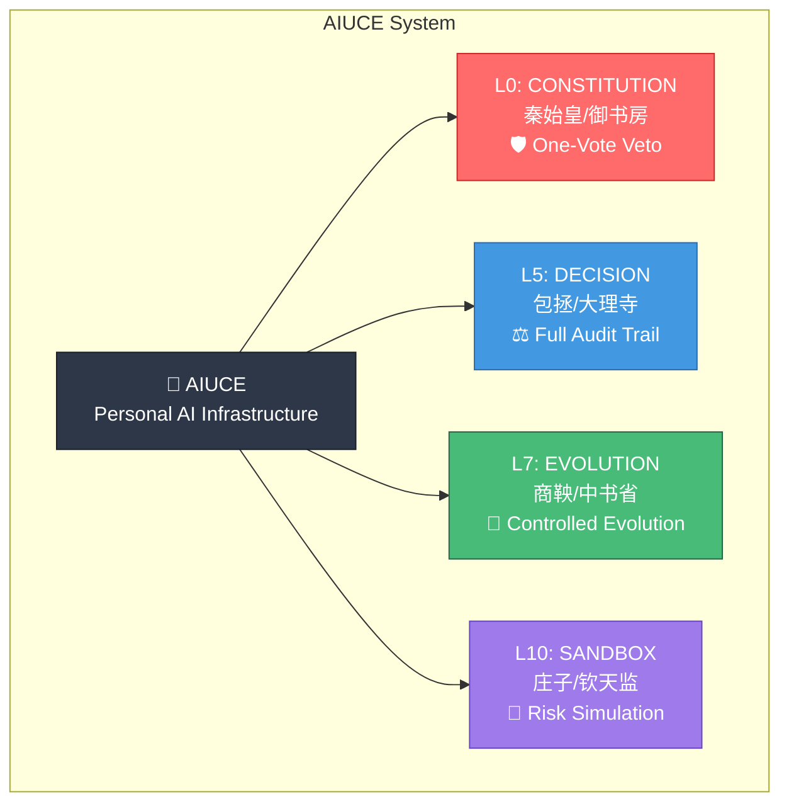

# AIUCE Social Preview Image

## 设计规格

- **尺寸**: 1200x630 pixels (GitHub 推荐)
- **格式**: PNG
- **用途**: GitHub 社交预览图（分享到 Twitter/LinkedIn/微信 时显示）

## 设计元素

### 主标题
```
AIUCE 🏯
Personal AI Infrastructure
with 11-Layer Governance
```

### 副标题
```
Inspired by Ancient Chinese Wisdom
```

### 核心卖点
```
✅ Constitutional Veto (L0)
✅ Full Audit Trail (L5)
✅ Controlled Evolution (L7)
✅ Risk Simulation (L10)
```

### 颜色方案
```
主色: #2D3748 (深灰)
强调: #4299E1 (蓝色)
背景: #F7FAFC (浅灰)
高亮: #FF6B6B (红色 - 用于 L0 Veto)
```

## ASCII 设计稿

```
┌────────────────────────────────────────────────────────────┐
│                                                            │
│    🏯 AIUCE                                                │
│    ════════════════════════════════════════════════════    │
│                                                            │
│    Personal AI Infrastructure                              │
│    with 11-Layer Governance                                │
│                                                            │
│    ┌────────────────────────────────────────────────┐     │
│    │                                                │     │
│    │   L0: CONSTITUTION  ────────→ 🛡️ VETO         │     │
│    │   L5: DECISION      ────────→ ⚖️ AUDIT         │     │
│    │   L7: EVOLUTION     ────────→ 🔄 EVOLVE        │     │
│    │   L10: SANDBOX      ────────→ 🧪 SIMULATE      │     │
│    │                                                │     │
│    └────────────────────────────────────────────────┘     │
│                                                            │
│    Inspired by Ancient Chinese Wisdom                      │
│                                                            │
│    github.com/billgaohub/AIUCE                            │
│                                                            │
└────────────────────────────────────────────────────────────┘
```

## Mermaid 图表版本（用于生成）



## 实现建议

### 方案 1: 使用 Canva/Figma
1. 创建 1200x630 画布
2. 使用提供的颜色方案
3. 添加文字和图标
4. 导出为 PNG

### 方案 2: 使用 HTML/CSS 生成
```html
<!DOCTYPE html>
<html>
<head>
  <style>
    .card {
      width: 1200px;
      height: 630px;
      background: linear-gradient(135deg, #667eea 0%, #764ba2 100%);
      font-family: -apple-system, BlinkMacSystemFont, 'Segoe UI', Roboto, sans-serif;
      display: flex;
      flex-direction: column;
      justify-content: center;
      padding: 60px;
      color: white;
    }
    .title {
      font-size: 72px;
      font-weight: bold;
      margin-bottom: 20px;
    }
    .subtitle {
      font-size: 36px;
      margin-bottom: 40px;
    }
    .features {
      font-size: 28px;
      line-height: 1.8;
    }
  </style>
</head>
<body>
  <div class="card">
    <div class="title">🏯 AIUCE</div>
    <div class="subtitle">Personal AI Infrastructure with 11-Layer Governance</div>
    <div class="features">
      ✅ Constitutional Veto (L0)<br/>
      ✅ Full Audit Trail (L5)<br/>
      ✅ Controlled Evolution (L7)<br/>
      ✅ Risk Simulation (L10)
    </div>
  </div>
</body>
</html>
```

### 方案 3: 使用 Python 生成
```python
from PIL import Image, ImageDraw, ImageFont

# 创建画布
img = Image.new('RGB', (1200, 630), color='#667eea')
draw = ImageDraw.Draw(img)

# 加载字体
font_large = ImageFont.truetype("Arial.ttf", 72)
font_medium = ImageFont.truetype("Arial.ttf", 36)

# 绘制文字
draw.text((60, 100), "🏯 AIUCE", fill='white', font=font_large)
draw.text((60, 200), "Personal AI Infrastructure", fill='white', font=font_medium)
draw.text((60, 250), "with 11-Layer Governance", fill='white', font=font_medium)

# 保存
img.save('social-preview.png')
```

## GitHub 配置

将生成的图片保存为：
```
/Users/bill/SONUV/AIUCE/.github/social-preview.png
```

GitHub 会自动在仓库首页显示此图片。
